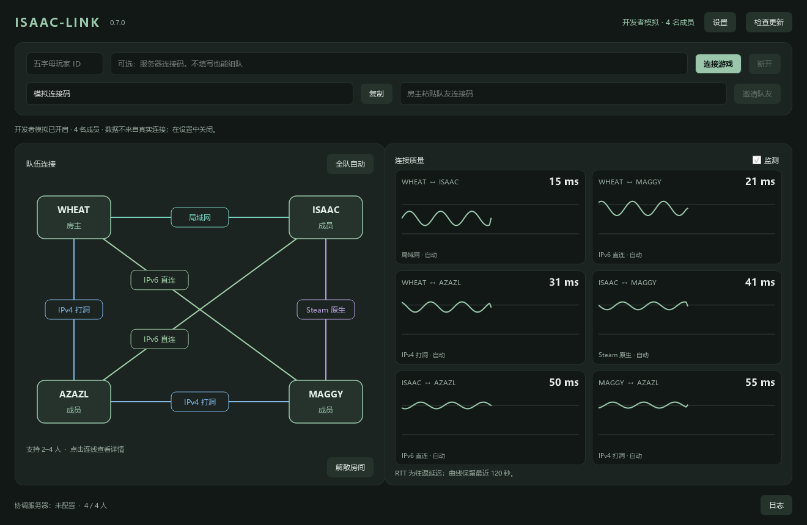

# Isaac-Link 0.7.2

《以撒的结合：忏悔＋》Windows Steam 版 2～4 人联机助手。

[下载 0.7.2 客户端](https://github.com/BBByeah/Isaac-Link/releases/download/v0.7.2/Isaac-Link-client-v0.7.2.zip) · [下载配套服务器](https://github.com/BBByeah/Isaac-Link/releases/download/v0.7.2/Isaac-Link-server-v0.7.2.zip) · [更新说明](https://github.com/BBByeah/Isaac-Link/releases/tag/v0.7.2) · [Gitee 源码镜像](https://gitee.com/bbbyeah/isaac-link)

0.7.1、0.7.2 为更新链路测试版本，联机功能与 0.7.0 一致。

## 新版功能

- 原生深色桌面，墨绿、酒红、黑金、紫色四种主题，不再通过浏览器运行。
- Steam 辅助通道组队，公共 STUN 发现 IPv4 端点；不填写服务器码也能使用基础模式。
- 每对玩家分别自动选择局域网、IPv6、IPv4 打洞、Steam 或可选服务器中转；每 30 秒评估，差距小时保持原线路。
- 游戏线路按玩家对设置，协调线路在设置中由房主全队统一指定，默认 Steam。指定线路不可用时等待恢复。
- 房主统一管理成员、一键全队自动；房主暂时失联不会触发重新选举或拆散已有连接。
- 输入冗余、监测和抓包；可选联网检查更新、签名下载、用户确认后升级和失败回滚。
- 监测卡片以延迟曲线为主，悬停时同时高亮卡片、对应玩家节点和连线。



## 使用

客户端 ZIP 解压后双击 **“以撒联机助手.exe”**；请保留旁边的 `_internal` 目录和 `updater.exe`，不要只复制主程序。

源码仓库不包含编译好的程序。本地完成构建后，可双击根目录的 **“启动以撒联机助手.cmd”**，它会启动 `dist\Isaac-Link\以撒联机助手.exe`。直接运行源码见下方命令。

1. 从 Steam 启动忏悔＋，停留在主菜单。
2. 解压客户端 ZIP 到可写目录，运行“以撒联机助手.exe”，填写五字母玩家 ID 并连接游戏。
3. 队友把个人连接码发给房主；房主添加后，队友在窗口中接受邀请。
4. 新玩家对默认自动选路；等待连通和接管状态后进入官方联机房间。
5. 点击玩家连线查看延迟并切换游戏线路；协调线路在设置中全队统一选择。“全队自动”仅恢复游戏线路自动选择。

“设置”在主窗口内打开：可更换主题、配置并检测 STUN 节点。无需游戏时，可在“开发者测试”中开启模拟成员，选择 1～4 人和不同连接状态，再返回联机页面查看拓扑。抓包入口也位于“开发者测试”，仅对真实连接生效。

点击拓扑连线上的线路框，原地展开各线路延迟，点击线路即可切换。点击玩家节点可填写并保存局域网地址。点击框外或按 Esc 缩回；更新和日志也在主窗口内展开。

服务器码可留空；填写时需使用兼容的新服务器。局域网线路需要房主点击双方玩家节点填写地址。IPv6 要求双方有可用公网 IPv6；IPv4 打洞受 NAT 条件限制。无法打洞时，自动模式可使用 Steam 或已配置的中转。

关闭主窗口会解除接管并退出；最小化继续联机。Steam 网络掉线与游戏进程退出是不同情况，后者需要重新连接游戏。

## 更新

启动检查可以关闭，也可手动检查、忽略本版本或稍后升级。联机中允许下载，安装前必须先断开助手。检查失败不影响使用。

0.6.5 首次迁移需手动下载新版。0.7.0 可以直接更新到最新 0.7.2，无需先安装 0.7.1。当前下载更新源为 GitHub；Gitee 同步源码和版本标签，尚未作为客户端下载源。协议 8 不支持与 0.6.x 客户端混组。

更新清单、签名和客户端 ZIP 必须作为 GitHub Release 附件发布；仅推送 Git 源码不会产生应用内更新。清单尚未发布或网络不可达时，程序会提示检查失败，当前版本仍可继续使用。

下载时验证 Ed25519 签名；安装前保留旧程序，等待新版成功启动，失败则恢复旧版。用户配置、日志和抓包文件会保留。

## 源码与构建

```powershell
py -3.13 -m venv .venv
.\.venv\Scripts\python.exe -m pip install -r scripts/requirements-build.txt
.\.venv\Scripts\python.exe -m isaac_link.desktop
```

界面演示：`python -m isaac_link.desktop --demo`。演示数据不是测量结果。

发布构建、签名密钥管理、测试和验收边界见 [0.7.0 开发记录](docs/V0.7.0.md)。可选服务端部署见 [部署说明](docs/server-deployment.md)。

项目使用 MIT 许可；第三方依赖见 [许可说明](licenses/THIRD_PARTY_NOTICES.md)。
