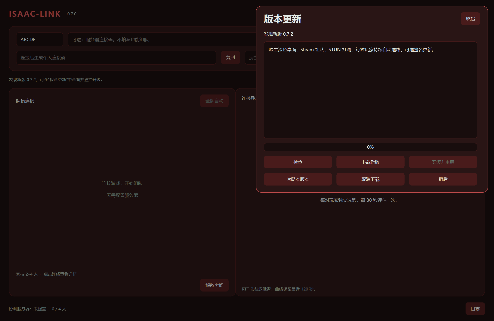
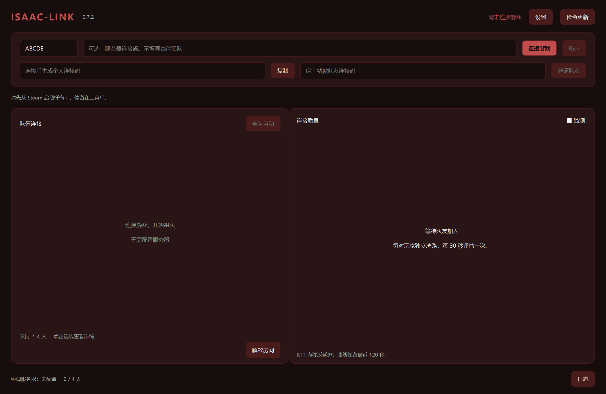

# 0.7.0 → 0.7.2 更新验证

## 发布内容

- GitHub 发布 `v0.7.1`、`v0.7.2` 两个更新测试版本，联机协议均为 8。
- 使用普通更新通道，非草稿、非预发布；旧客户端的 `releases/latest/download/update.json` 指向 0.7.2。
- 0.7.2 当前附件为 `Isaac-Link-client-v0.7.2-r1.zip`，修复源码对应标签 `v0.7.2-r1`。客户端版本仍为 0.7.2。
- Gitee 同步源码、README 和版本标签；客户端附件与更新清单从 GitHub 下载，Gitee 尚未配置为下载镜像。

## 实测中发现的问题

首次使用原始 0.7.0 程序点击安装时，版本识别、下载和签名验证通过，但安装失败：更新器继承安装目录作为工作目录，Windows 拒绝重命名该目录，报 `WinError 32`。此轮不能视为更新成功。

0.7.2 r1 将更新器的工作目录改为独立临时目录。已有 0.7.0 / 0.7.1 需要先退出程序，把发布页的 `start-isaac-link.cmd` 放在主程序旁，通过它启动后再检查更新。该脚本从系统临时目录启动旧程序，旧 EXE 无需替换。

## 验证方法

`scripts/verify_cross_version_ui.py` 使用原始 0.7.0 ZIP 中未经修改的冻结程序、隔离配置目录以及实际窗口按钮，访问公开 GitHub 更新地址。启动工作目录位于安装目录之外，与兼容启动脚本相同；未替换客户端版本号、更新器或公钥。

测试保存玩家 ID、酒红主题、日志和抓包样本，跳过 0.7.1，检查 0.7.2 窗口、安装标记、旧版备份及用户数据。实机 UI 自动化需要额外安装 `pywinauto`、`psutil`、`Pillow`。

## 实测结果（2026-09-29，Windows）

| 项目 | 结果 |
| --- | --- |
| 原始 0.7.0 检查公开更新源 | 直接发现 0.7.2，跳过 0.7.1 |
| 通过真实按钮下载 | 97,414,724 字节，客户端完成 Ed25519 验证 |
| 安装并重启 | 成功显示 0.7.2，安装标记一致 |
| 配置保留 | 玩家 ID `ABCDE`、酒红主题保留 |
| 文件保留 | 日志与抓包样本内容保留 |
| 旧程序备份 | 保留版本为 0.7.0 的备份目录 |
| 自动测试 | `python -m unittest discover -s tests`，72 项通过 |

结果以安装目录外的工作目录启动为前提，不能推断未使用兼容启动方式的旧版直接 EXE 启动也能正常安装。检测最新版本本身不依赖此修复。真实 Steam 联机和不同 NAT 环境测试不属于本次更新验证。

## 后续版本发布条件

提高客户端版本号，保留相同签名公钥和兼容协议，构建 ZIP 并用仓库外的发布私钥签名；将 ZIP、签名清单 `update.json` 发布为 GitHub 最新普通 Release。仅推送源码或建立标签不会产生客户端更新，预发布也不会进入当前稳定更新通道。

客户端比较版本号大小，可跨过中间版本。以后更换公钥或不兼容协议时需要另行设计迁移，不能把本次结果当成任意未来协议均可自动升级的保证。
